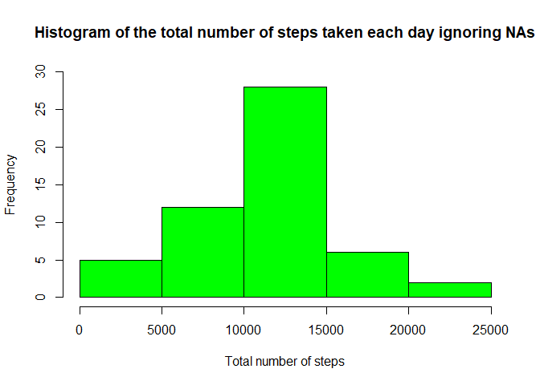
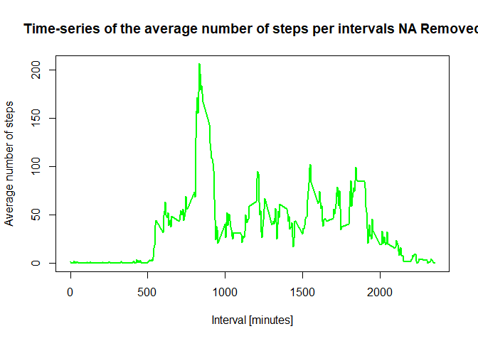
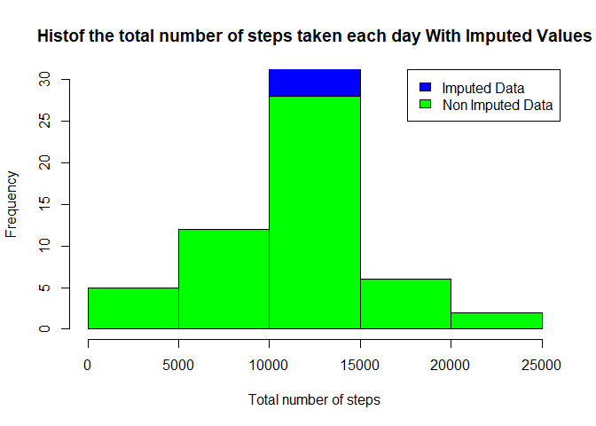
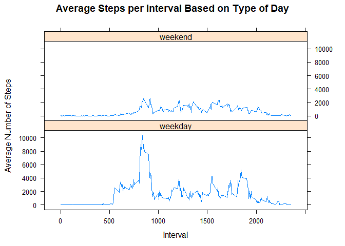

## Loading and preprocessing the data

```r
library(dplyr)

# Load the raw activity data
activity <- read.csv("activity.csv", stringsAsFactors=FALSE)
activity$date <- as.Date(activity$date)
day<-weekdays(activity$date)
activity$daytype= ifelse(tolower(day)=="saturday"|tolower(day)=="sunday","weekend","weekday")
```
##Here is the first few lines of the processed data

```r
head(activity)
```

```
##   steps       date interval daytype
## 1    NA 2012-10-01        0 weekday
## 2    NA 2012-10-01        5 weekday
## 3    NA 2012-10-01       10 weekday
## 4    NA 2012-10-01       15 weekday
## 5    NA 2012-10-01       20 weekday
## 6    NA 2012-10-01       25 weekday
```

## What is mean total number of steps taken per day?

```r
# Compute the total number of steps each day with NAs removed
stepsumOne <- aggregate(steps~date,data=activity,FUN=sum, na.rm=TRUE)
stepsumOne$steps
```

```
##  [1]   126 11352 12116 13294 15420 11015 12811  9900 10304 17382 12426
## [12] 15098 10139 15084 13452 10056 11829 10395  8821 13460  8918  8355
## [23]  2492  6778 10119 11458  5018  9819 15414 10600 10571 10439  8334
## [34] 12883  3219 12608 10765  7336    41  5441 14339 15110  8841  4472
## [45] 12787 20427 21194 14478 11834 11162 13646 10183  7047
```

### Computing Histogram

```r
hist(stepsumOne$steps, 
     col="green", 
     xlab="Total number of steps", 
     ylim=c(0, 30), 
     main="Histogram of the total number of steps taken each day ignoring NAs")
```

<!-- -->

### Computing Mean and Median of the total no. of steps per day

```r
mean(stepsumOne$steps)
```

```
## [1] 10766.19
```

```r
median(stepsumOne$steps)
```

```
## [1] 10765
```


## What is the average daily activity pattern?

```r
# Compute the means of steps accross all days for each interval
mean_steps <- aggregate(steps~interval,data=activity,FUN=mean, 
                       na.rm=TRUE)
head(mean_steps)
```

```
##   interval     steps
## 1        0 1.7169811
## 2        5 0.3396226
## 3       10 0.1320755
## 4       15 0.1509434
## 5       20 0.0754717
## 6       25 2.0943396
```

```r
names(mean_steps) <- c("interval", "mean")
```
### Time Series Plot

```r
# Compute the time series plot
plot(mean_steps$interval, 
     mean_steps$mean, 
     type="l", 
     col="green", 
     lwd=2, 
     xlab="Interval [minutes]", 
     ylab="Average number of steps", 
     main="Time-series of the average number of steps per intervals NA Removed")
```

<!-- -->

### Finding the maximum number of steps

```r
# We find the position of the maximum mean
max_pos <- which(mean_steps$mean == max(mean_steps$mean))

# We lookup the value of interval at this position

max_interval <- mean_steps[max_pos, 1]
max_interval
```

```
## [1] 835
```
## Imputing missing values

```r
sum(is.na(activity$steps))
```

```
## [1] 2304
```

```r
head(activity)
```

```
##   steps       date interval daytype
## 1    NA 2012-10-01        0 weekday
## 2    NA 2012-10-01        5 weekday
## 3    NA 2012-10-01       10 weekday
## 4    NA 2012-10-01       15 weekday
## 5    NA 2012-10-01       20 weekday
## 6    NA 2012-10-01       25 weekday
```

```r
df<-split(activity,activity$interval)
meanStepIntervalVector<-mean_steps$mean
for(i in 1:length(df)){
  ##print(i)
  ##print(which(is.na(df[[i]]$steps)))
  df[[i]]$steps[which(is.na(df[[i]]$steps))]<-meanStepIntervalVector[i]
  ##print(df[[i]]$steps)
}
dfMerged<-do.call(rbind,df)
dfMerged<-dfMerged[order(dfMerged$date,dfMerged$interval),]
```
###Compare the total steps results after Imputing NA Values.

```r
stepsumTwo <- aggregate(steps~date,data=dfMerged,FUN=sum)
hist(stepsumTwo$steps, 
     col="blue", 
     xlab="Total number of steps", 
     ylim=c(0, 30), 
     main="Histof the total number of steps taken each day With Imputed Values")
hist(stepsumOne$steps, 
     col="green", 
     xlab="Total number of steps", 
     ylim=c(0, 30), 
     main="Histogram of the total number of steps taken each day ignoring NAs",add=T)
legend("topright", c("Imputed Data", "Non Imputed Data"), fill=c("blue", "green") )
```

<!-- -->

```r
mean(stepsumTwo$steps)
```

```
## [1] 10766.19
```

```r
median(stepsumTwo$steps)
```

```
## [1] 10766.19
```
### There is not much difference in the mean and median values before and after imputing the NAs.

## Are there differences in activity patterns between weekdays and weekends?

```r
library(lattice)
aggregateDayType<-aggregate(steps~interval+daytype,data=dfMerged,FUN=sum, na.rm=TRUE)
xyplot(steps~interval|daytype, data=aggregateDayType, type="l",  layout = c(1,2),
main="Average Steps per Interval Based on Type of Day", 
ylab="Average Number of Steps", xlab="Interval")
```

<!-- -->

###Yes there is the marked difference in the activity patterns between weekday and weekends as shown in the lattice plot above.Although the trend is same
